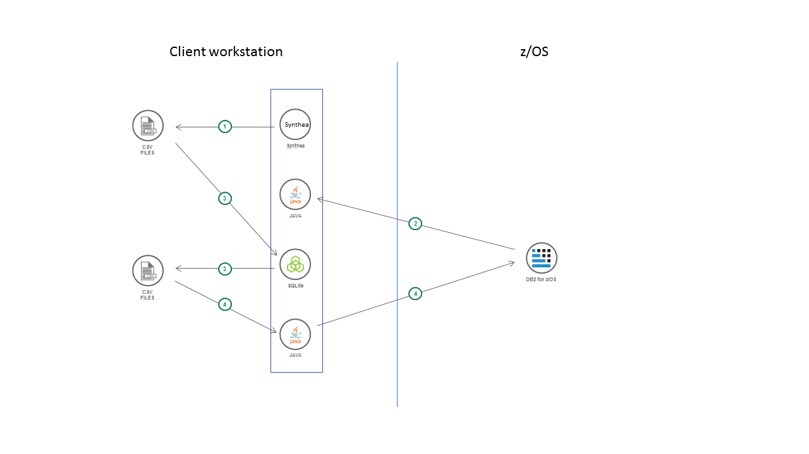

# Transforming and loading big data CSV files into a DB2 for z/OS database

This code pattern offers a tried and tested approach for transforming a large set of varying CSV schemas into a subset of SQL schemas using an open-source tool called SQLite
and loading them to a DB2 for z/OS database using a JDBC function called zload.

This work was done as part of the Summit Health set of code patterns, which demonstrate how cloud technology can access data stored on z/OS systems.
We needed a way to generate a large amount of patient health care data to populate the DB2 for z/OS database.
We found an open source tool called [Synthea](https://github.com/synthetichealth/synthea/) which generates the kind of synthentic data we wanted.

The Synthea CSV files needed to be transformed to match the table schemas used in the Summit Health application.
We found a public domain tool called [SQLite](https://www.SQLite.org/index.html) which made these transformations easy.

Finally the transformed CSV files needed to be loaded from a distributed workstation into the DB2 for z/OS database.
We used a JDBC function called [zload](https://www.ibm.com/support/knowledgecenter/en/SSEPGG_11.1.0/com.ibm.db2.luw.apdv.java.doc/src/tpc/imjcc_tjv00027.html) to accomplish this.
zload requires DB2 for z/OS version 12.

When the reader has completed this Code Pattern, they will understand how to:

* use SQLite to transform a CSV file to match the schema of a DB2 table
* use JDBC to load a CSV file from a distributed workstation into a DB2 for z/OS database.

## Flow

A shell script (`run.sh` or `run.bat`) drives the processing.  There are four main steps as shown below.



1. The Synthea tool is called to generate a set of CSV files containing synthesized patient health care data.
2. A JDBC program is called to determine the current maximum patient number in the DB2 for z/OS database.
3. The SQLite program is called to transform the CSV files produced by Synthea to match the schema of the DB2 for z/OS database.
4. A JDBC program is called to load the transformed CSV files into the DB2 for z/OS database tables.

The Synthea tool produces a variety of data.  We were interested in the following subset:
* patients
* observations
* medications
* conditions

We needed to do some transformations from the [Synthea schemas](https://github.com/synthetichealth/synthea/wiki/CSV-File-Data-Dictionary) to our [DB2 schemas](schemas.sql).
1. Patients are identified by UUIDs in Synthea files and by integers in our database.
2. Our database has a subset of the columns produced by Synthea and some of our columns have shorter length restrictions.

The SQLite tool makes it easy to do these transformations on CSV files.
To transform the patients file, we used the ROW_NUMBER() function to assign integer patient ids.
In order to avoid conflicts with existing patient numbers, before using SQLite we call a JDBC program to get the highest patient number in use.
That number is added to all the rows.
(It is assumed no other patients are being added to the database at the same time.)

To transform the observations, medications and conditions files, we use a JOIN with the transformed patients file to substitute the
patient UUIDs with the integer ids.

We also used SQLite to create data for other tables (users, appointments) that don't exist in the Synthea data.
This data could have been generated on z/OS instead but it was easier to reuse the framework for transforming files
to generate new ones as well.

Finally to get the data into the DB2 for z/OS database we made use of the zload JDBC function.
The zload function transfers the CSV file to z/OS and invokes the LOAD utility to load the file into a table.
The JDBC program uses parameters to know which database to connect to, the credentials needed for the connection,
the table to load, and the column format of the CSV file.

zload requires DB2 for z/OS version 12.
It also requires the IBM Data Server Driver for JDBC version 4.22.29 or later.

# Steps

1. Install the following prerequisite tools.
    * A Java 8 (or higher) JDK such as [OpenJDK](https://openjdk.java.net/install/index.html)
    * [maven](https://maven.apache.org/download.cgi)
    * [gradle](https://gradle.org/install/)
    * [SQLite](https://SQLite.org/download.html) version 3.26.0 
    * DB2 JDBC driver version 4.22.29 or later.  This needs to be installed in your local Maven artifact repository.
        * If you already have the DB2 JDBC driver version 4.22.29 or later in your internal Maven artifact repository, you can use it.
        You might need to change the `groupId`, `artifactId`, and `version` for the dependency in this project's `pom.xml` file to match the values used in your repository.
        * Otherwise download the [DB2 JDBC Driver](http://www-01.ibm.com/support/docview.wss?uid=swg21363866) version 4.22.29.  Extract the `db2jcc4.jar` file from the downloaded archive file
        and run the following command to install it to your local Maven repository:
        ```
        mvn install:install-file -Dfile=db2jcc4.jar -Dversion=4.22.29 -DgroupId=com.ibm.db2.jcc -DartifactId=db2jcc4 -Dpackaging=jar
        ```

2. Clone and build this project.
    ```
    git clone https://github.com/IBM/summit-health-synthea.git
    cd summit-health-synthea
    mvn package
    ```

3. Clone and build the [Synthea project](https://github.com/synthetichealth/synthea/)
    ```
    git clone https://github.com/synthetichealth/synthea.git
    cd synthea
    ./gradlew build check test
    ```

    If you encounter any OutOfMemoryError exceptions you may need to update the `build.gradle` file to increase the size of the Java heap.

    ```
    test {
        maxHeapSize = "8192m"
    }
    run {
        maxHeapSize = "8192m"
    }
    ```

4. Change the following properties in synthea/src/main/resources/synthea.properties:
    * Set exporter.csv.export to true
    * Set generate.append_numbers_to_person_names = false (optional)

5. Create the DB2 for z/OS database.  The [schemas.sql](schemas.sql) file contains SQL for creating the database.  You can use SPUFI
or the DSNTEP2 or DSNTIAD sample programs to process the SQL.  You can change the database name or schema name if desired.

6. Set up environment variables that the script needs to connect to your DB2 for z/OS database.
This includes the database URL, a userid and password to authenticate to DB2, and the database schema name where you defined the tables.
If you do not set these variables, the script prompts you for them.  (Beware that the Windows
script does not mask the database password when you type it so it is recommended to use the
variable instead.)

    ```
    export DATABASE_URL=//host:port/location
    export DATABASE_USER=userid
    export DATABASE_PASSWORD=password
    export DATABASE_SCHEMA=schema name
    ```

7. Run the script from this project with the current directory set to your synthea project.
(The syntax below assumes you cloned this project and the synthea project to sibling folders.)

    ```
    cd synthea
    ../summit-health-synthea/run 10 "New York"
    ```

    The first argument tells Synthea how many patients to generate.
    The second argument tells Synthea which U.S. state the patients live in.

# Sample output

Sample output from the script is in the [sample.out](sample.out) file.

Elapsed time to generate, transform and load 5000 patients:
* Synthea tool:  5m 50s
* SQLite transformations:  14s
* zload calls:  2m 19s

## License

This code pattern is licensed under the Apache License, Version 2.
Separate third-party code objects invoked within this code pattern are licensed by their respective providers pursuant to their own separate licenses.
Contributions are subject to the [Developer Certificate of Origin, Version 1.1](https://developercertificate.org/) and the [Apache License, Version 2](https://www.apache.org/licenses/LICENSE-2.0.txt).

[Apache License FAQ](https://www.apache.org/foundation/license-faq.html#WhatDoesItMEAN)